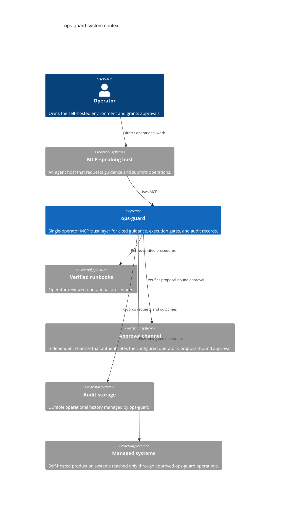
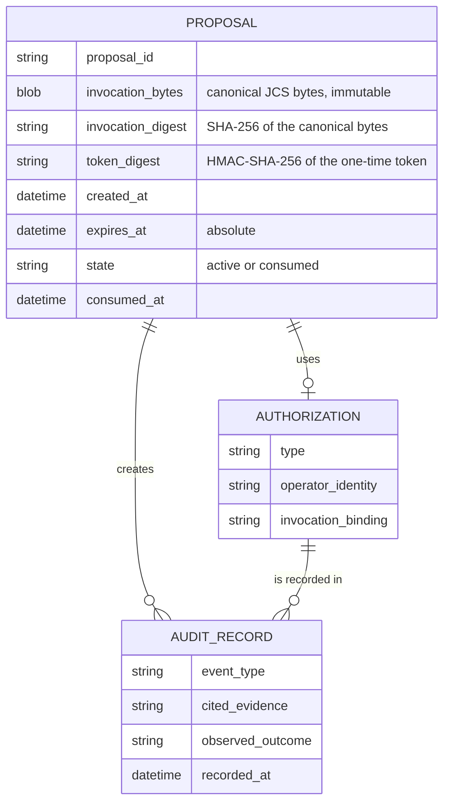

# Architecture

ops-guard is a single-operator trust layer for operations submitted by an MCP-speaking agent. It applies evidence, authorization, precondition, and audit gates before an operation reaches a managed self-hosted system. It does not prevent an agent that already has separate system access from bypassing the server.

The audit record is append-only operational history. It is not a tamper-evident ledger and does not itself protect against storage-level deletion; deployments needing that assurance must retain audit records independently.

The server persists the following logical records. This describes the required relationships, not a storage implementation.

The proposal store is transactional (SQLite today) so that token consumption can commit atomically with the pre-execution audit append; the frozen-invocation and token contract is recorded in [ADR 0002](adr/0002-frozen-invocation-audit-contract.md).
