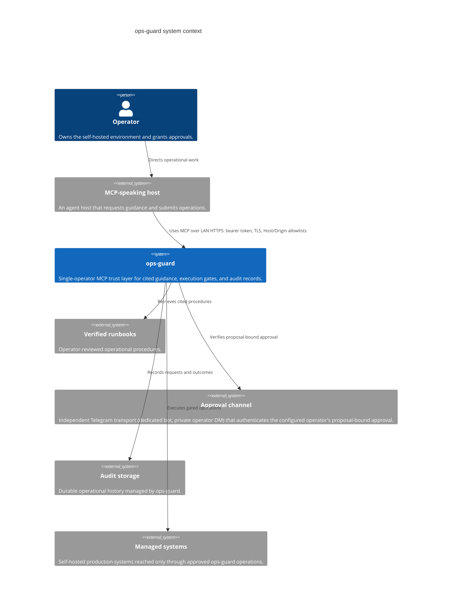
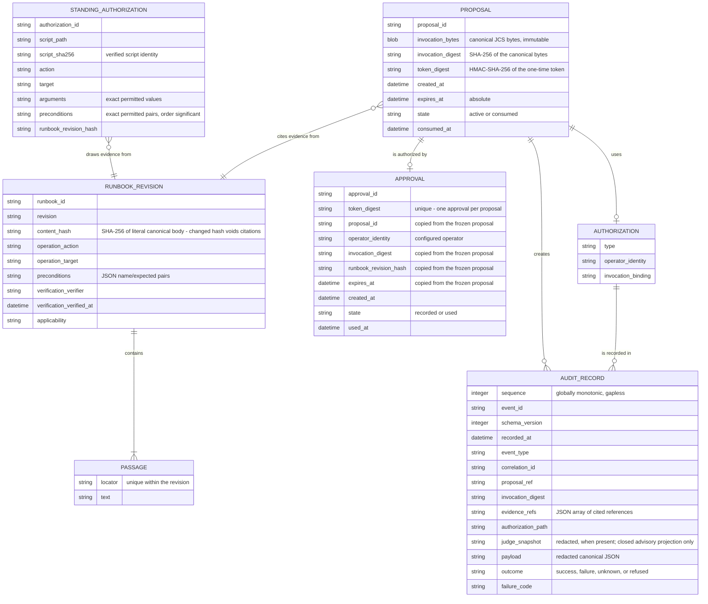

# Architecture

ops-guard is a single-operator trust layer for operations submitted by an MCP-speaking agent. It applies evidence, authorization, precondition, and audit gates before an operation reaches a managed self-hosted system. It does not prevent an agent that already has separate system access from bypassing the server.

```mermaid
C4Context
    title ops-guard system context
    Person(operator, "Operator", "Owns the self-hosted environment and grants approvals.")
    System_Ext(host, "MCP-speaking host", "An agent host that requests guidance and submits operations.")
    System(guard, "ops-guard", "Single-operator MCP trust layer for cited guidance, execution gates, and audit records.")
    System_Ext(runbooks, "Verified runbooks", "Operator-reviewed operational procedures.")
    System_Ext(approval, "Approval channel", "Independent Telegram transport (dedicated bot, private operator DM) that authenticates the configured operator's proposal-bound approval.")
    System_Ext(audit, "Audit storage", "Durable operational history managed by ops-guard.")
    System_Ext(systems, "Managed systems", "Self-hosted production systems reached only through approved ops-guard operations.")

    Rel(operator, host, "Directs operational work")
    Rel(host, guard, "Uses MCP over LAN HTTPS: bearer token, TLS, Host/Origin allowlists")
    Rel(guard, runbooks, "Retrieves cited procedures")
    Rel(guard, approval, "Verifies proposal-bound approval")
    Rel(guard, audit, "Records requests and outcomes")
    Rel(guard, systems, "Executes gated operations")
```

The deployment boundary for the running service is `python -m ops_guard`
([ADR 0006](adr/0006-lan-mcp-transport.md)): FastMCP Streamable HTTP with
native Uvicorn TLS on the configured LAN interface, a static high-entropy
bearer token compared in constant time, explicit Host/Origin allowlists,
and fail-closed startup over the environment contract, runbook directory,
certificate pair, and crash reconciliation. The bearer token is transport
authentication, not authorization; it never substitutes for standing
authorization or proposal-bound approval. The LAN listener carries the
retrieval tool and the host-composed proposal tool; judging, approval, and
execution surfaces arrive in later stages.

The approval channel is an outbound-only Telegram transport
([ADR 0010](adr/0010-telegram-approval-transport.md)): the server long-polls
`getUpdates` on a fresh dedicated bot and delivers proposal previews to one
configured private operator DM. Only a callback from the configured numeric
operator in the configured chat records an approval — by proposal id, never
by recovering the raw token — through the internal verifier's existing
transaction. The transport is opt-in and disabled by default; a deployment
that cannot keep the bot token and approval authority outside the proposing
MCP runtime keeps approval unavailable and execution fail-closed.

```mermaid
sequenceDiagram
    participant S as ops-guard server
    participant T as Telegram Bot API
    participant O as Operator (private DM)
    S->>S: proposal committed (id, digest, expiry; token to MCP host once)
    S->>T: sendMessage preview (plain text, redacted, no token)
    T->>O: preview + Approve button (final part only)
    O->>T: tap Approve (callback data = approve:<proposal_id>)
    S->>T: getUpdates long poll (callback_query only)
    T-->>S: callback (user id, chat id, message from this bot)
    S->>S: verify origin, parse data, revalidate frozen proposal in transaction
    S->>S: record approval bound to stored token digest (unique, single-use)
    S->>T: answerCallbackQuery (best effort, after the durable outcome)
```

The advisory judge is an outbound-only loopback boundary
([ADR 0009](adr/0009-local-advisory-judge-audit-projection.md)): the server
process calls the local Ollama HTTP API on a literal loopback address
(`127.0.0.1:11434`) through the pinned local-judge library — proxy
environment variables are ignored and redirects are never followed, so
judge traffic cannot leave the machine. Only the closed, versioned
projection is persisted; the raw trace never reaches the audit log.

The audit record is append-only operational history. It is not a tamper-evident ledger and does not itself protect against storage-level deletion; deployments needing that assurance must retain audit records independently.

The server persists the following logical records. This describes the required relationships, not a storage implementation.

```mermaid
erDiagram
    RUNBOOK_REVISION ||--|{ PASSAGE : "contains"
    STANDING_AUTHORIZATION }o--|| RUNBOOK_REVISION : "draws evidence from"
    PROPOSAL }o--|| RUNBOOK_REVISION : "cites evidence from"
    PROPOSAL ||--o| APPROVAL : "is authorized by"
    PROPOSAL ||--o| AUTHORIZATION : "uses"
    PROPOSAL ||--o{ AUDIT_RECORD : "creates"
    AUTHORIZATION ||--o{ AUDIT_RECORD : "is recorded in"
    STANDING_AUTHORIZATION {
        string authorization_id
        string script_path
        string script_sha256 "verified script identity"
        string action
        string target
        string arguments "exact permitted values"
        string preconditions "exact permitted pairs, order significant"
        string runbook_revision_hash
    }
    RUNBOOK_REVISION {
        string runbook_id
        string revision
        string content_hash "SHA-256 of literal canonical body - changed hash voids citations"
        string operation_action
        string operation_target
        string preconditions "JSON name/expected pairs"
        string verification_verifier
        datetime verification_verified_at
        string applicability
    }
    PASSAGE {
        string locator "unique within the revision"
        string text
    }
    PROPOSAL {
        string proposal_id
        blob invocation_bytes "canonical JCS bytes, immutable"
        string invocation_digest "SHA-256 of the canonical bytes"
        string token_digest "HMAC-SHA-256 of the one-time token"
        datetime created_at
        datetime expires_at "absolute"
        string state "active or consumed"
        datetime consumed_at
    }
    APPROVAL {
        string approval_id
        string token_digest "unique - one approval per proposal"
        string proposal_id "copied from the frozen proposal"
        string operator_identity "configured operator"
        string invocation_digest "copied from the frozen proposal"
        string runbook_revision_hash "copied from the frozen proposal"
        datetime expires_at "copied from the frozen proposal"
        datetime created_at
        string state "recorded or used"
        datetime used_at
    }
    AUTHORIZATION {
        string type
        string operator_identity
        string invocation_binding
    }
    AUDIT_RECORD {
        integer sequence "globally monotonic, gapless"
        string event_id
        integer schema_version
        datetime recorded_at
        string event_type
        string correlation_id
        string proposal_ref
        string invocation_digest
        string evidence_refs "JSON array of cited references"
        string authorization_path
        string judge_snapshot "redacted, when present; closed advisory projection only"
        string payload "redacted canonical JSON"
        string outcome "success, failure, unknown, or refused"
        string failure_code
    }
```

The proposal store is transactional (SQLite today) so that token consumption can commit atomically with the pre-execution audit append; the frozen-invocation and token contract is recorded in [ADR 0002](adr/0002-frozen-invocation-audit-contract.md). The proposal, approval, and audit records share one database boundary by construction: the approval verifier and the execution gate validate store pairing at initialization and reject a split configuration (`GateConfigurationError`) before any operation can be dispatched, so one execution history can never be divided across database files. An approval is recorded only on the internal operator path, is single-use, and its recorded-to-used transition joins the token-consumption transaction ([ADR 0003](adr/0003-approval-verifier-boundary.md)). Audit events are insert-only with write-time redaction: sensitive values are replaced by an explicit redaction marker plus a keyed fingerprint; the audit interface exposes append and read only. Runbook revisions are immutable and human-verified ([runbook format](runbook-format.md)): a citation qualifies as required procedural evidence only when it is bound to a revision whose content hash recomputes exactly — a changed hash voids the citation. Standing authorization matches the frozen invocation against the complete permitted invocation as exact equality ([ADR 0004](adr/0004-exact-standing-authorization.md)); the records come from the operator-owned policy file ([ADR 0011](adr/0011-operator-configured-precondition-observers.md)), which also binds each verified revision's precondition index to a fixed, code-defined read-only observer. The gate resolves every precondition through the server's observer registry immediately before authorization — caller-supplied observations no longer exist — and records the observer id and canonical policy digest per observation. External state may change between observation and dispatch; the snapshot is recorded, not an atomic lock. The execution gate (`src/ops_guard/gate.py`) is the sole composition point: evidence, preconditions, token validity, one authorization path, the token consumption, the execution-start audit append, and the approval flip all pass through it, and every failed check records a refusal before any side effect.
