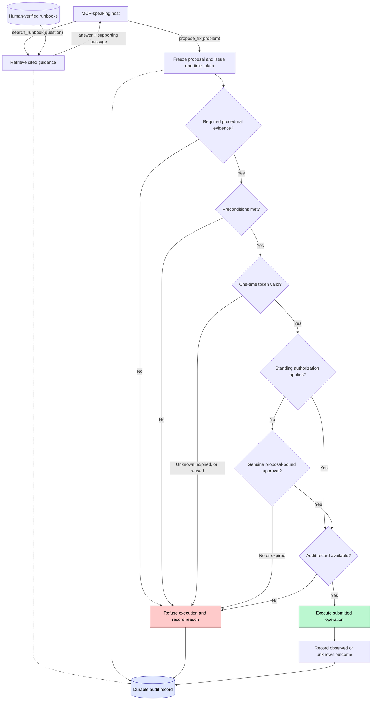

# System Flow

The judge may attach an advisory risk assessment to a proposal, but it does not alter any gate in this flow and cannot authorize execution. Proposal-bound approval is recorded and verified by the internal approval verifier (docs/adr/0003-approval-verifier-boundary.md): the proposing host cannot supply it, and the approval is spent exactly when its token is consumed. Standing authorization (docs/adr/0004-exact-standing-authorization.md) matches the frozen invocation against the complete permitted invocation — verified script identity, action, target, arguments, preconditions, runbook revision hash — as exact equality; missing or unequal fields never match, and there are no wildcards. Audit events are insert-only and redacted at write time; the pre-execution append commits in the same durable transaction as the token consumption, so a required audit failure refuses the execution. Runbook revisions are immutable and human-verified (docs/runbook-format.md); cited guidance qualifies as required procedural evidence only when bound to an unchanged revision.
